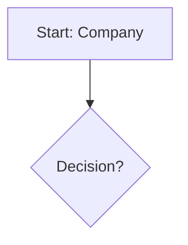

# Mermaid Syntax Error Fix

## Common Mermaid Syntax Issues

### 1. Special Characters in Node Labels
Mermaid may have issues with certain special characters. The service now cleans the syntax before rendering.

### 2. Code Block Wrapping
If the AI returns Mermaid code wrapped in markdown code blocks, the HTML now automatically extracts it.

### 3. Testing Mermaid Syntax

If you get syntax errors, you can:

1. **Test on Mermaid Live Editor:**
   - Go to https://mermaid.live
   - Paste your Mermaid code
   - Check for syntax errors

2. **Common Fixes:**
   - Ensure proper indentation
   - Check for unclosed brackets/parentheses
   - Verify node IDs don't contain spaces (use underscores)
   - Escape special characters in labels

### 4. Example of Fixed Syntax

**Before (may cause errors):**

**After (safer):**

The HTML page now automatically:
- Removes markdown code blocks
- Cleans the syntax
- Provides better error messages
- Shows the raw code for debugging

